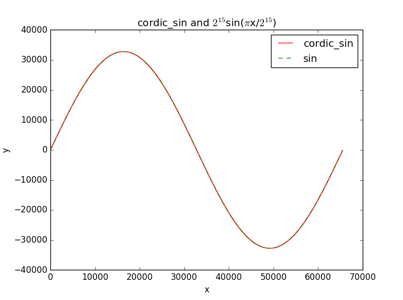
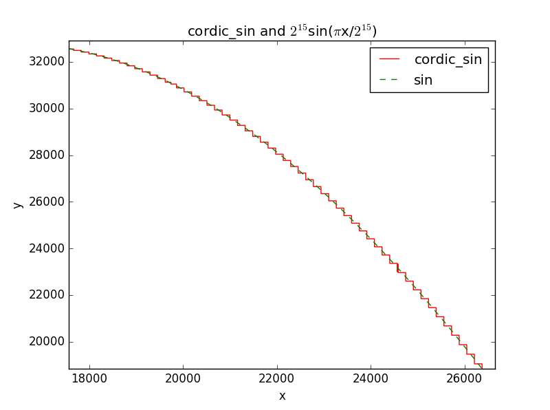

# 基本实现
### cordic算法
```matlab
function [S,C]=cordic(deg,width,index)
%宽度16位，1对应2^15次方
%width=2^16;
%index=15;
z(1)=deg;
x(1)=floor(0.60725*width/2);
y(1)=0;


for step=0:index
    if(z(step+1)>=0)
        x(step+2)=x(step+1)-floor(y(step+1)/2^step);
         y(step+2)=y(step+1)+floor(x(step+1)/2^step);
        z(step+2)=z(step+1)-floor(width*atan(1/2^step)*180/pi/360);
    else
        x(step+2)=x(step+1)+floor(y(step+1)/2^step);
         y(step+2)=y(step+1)-floor(x(step+1)/2^step);
        z(step+2)=z(step+1)+floor(width*atan(1/2^step)*180/pi/360);
    end
    
    
end


 C=x(index+1);
 S=y(index+1);

```
### 测试代码
```matlab
%计算cordic误差

clc
clear
s=zeros(1,91);
c=zeros(1,91);
std_s=zeros(1,91);
std_c=zeros(1,91);
S_err=zeros(1,91);
width1=2^16;
index1=7;
for i=0:90
    deg=floor(width1*i/360);
    [s(i+1),c(i+1)]=cordic(deg,width1,index1);
    std_s(i+1)=width1*sind(i)/2;
    std_c(i+1)=width1*cosd(i)/2;
     S_err(i+1)=abs(std_s(i+1)-s(i+1));   
end
subplot(2,1,1);
plot(0:90,S_err,'r*');
%ylim([0 300]);
ylim([0 max(S_err)*1.2]);
title('误差');
xlabel('deg');
ylabel('abs(err*2^{15})');
subplot(2,1,2);

%位宽16位，迭代次数9次
plot(0:90,std_s,'r*',0:90,s,'b+');
ylim([0 2^15+2^12]);
title('sin(x)cordic与真实值比较');
xlabel('deg');
ylabel('sin(x)*2^15');

 fprintf('+--------------------------------+\n');

for i=0:18
    fprintf('|  %4d  | %9d | %9d |\n',i*5,s(i*5+1),floor(std_s(i*5+1)));
    fprintf('+--------------------------------+\n');
end
```


|deg  |  cordic_sin |sin|
|-----|:---------:|:-------:|
|     0  |       -25 |         0 |
|     5  |      3007 |      2855 |
|    10  |      6045 |      5690 |
|    15  |      8041 |      8480 |
|    20  |     11675 |     11207 |
|    25  |     13563 |     13848 |
|    30  |     16291 |     16383 |
|    35  |     18852 |     18794 |
|    40  |     21274 |     21062 |
|    45  |     22822 |     23170 |
|    50  |     24921 |     25101 |
|    55  |     26799 |     26841 |
|    60  |     28429 |     28377 |
|    65  |     29827 |     29697 |
|    70  |     30615 |     30791 |
|    75  |     31764 |     31651 |
|    80  |     32204 |     32270 |
|    85  |     32626 |     32643 |
|    90  |     32767 |     32768 |

# 误差计算
```python
#-*-coding:utf-8 -*-
#!/usr/bin/env python
import sys
import math
import pylab as plt
def cordic(deg,times=8,width=16):
 	width_value=2**width
 	quadrant=deg>>(width-2)
 	x=int(0.60725*width_value/2)
 	y=0
 	z=deg%(2**(width-2))
 	for i in range(times):
 		if z>=0:
 			x_new=x-int(y>>i)
 			y_new=y+int(x>>i)
 			z=z-int(width_value*math.atan(1.0/(1<<i))/(math.pi*2))
		else:
			x_new=x+int(y>>i)
 			y_new=y-int(x>>i)
 			z=z+int(width_value*math.atan(1.0/(1<<i))/(math.pi*2))
		x=x_new
		y=y_new
 	if quadrant==0:
 		cordic_cos=x
 		cordic_sin=y
	elif quadrant==1:
		cordic_cos=-y
 		cordic_sin=x
 	elif quadrant==2:
 		cordic_cos=-x
 		cordic_sin=-y
	else:
		cordic_cos=y
 		cordic_sin=-x
	return cordic_cos,cordic_sin

def err_table(cordic_sin,std_sin):
	N=24
	print "+"+ "-"*29+"+"
	for i in range(N):
		a=360*i/N
		x=cordic_sin[len(cordic_sin)*i/N]
		y=std_sin[len(std_sin)*i/N]
		if math.fabs(y)<=0.1:
			err="  -  "
		else:
			err=100.0*math.fabs(float(x-y)/y)
			err="%3.2f" %err
		print "|%5d|%8d|%8d|%5s|" %(a,x,int(y),err)
		print "+"+ "-"*29+"+"

def main():
	x=[i for i in range(2**16)]
	cordic_sin=[cordic(i)[1] for i in x]
	std_sin=[2**15*math.sin(math.pi*i/(2**15)) for i in x]
	line1,=plt.plot(x,cordic_sin,'r-',label='cordic_sin')
	line2,=plt.plot(x,std_sin,'g--',label='sin')
	err_table(cordic_sin,std_sin)
	plt.legend(handles=[line1,line2])
	plt.xlabel('x')
	plt.ylabel('y')
	plt.title('cordic_sin and $2^{15}$sin($\pi$x/$2^{15}$)')
	plt.show()

if __name__ == '__main__':
	main()
```
- 标准正弦与cordic计算值比较
 
 


|deg  |  cordic_sin |sin|误差(%)|
|-----|:---------:|:-------:|:-----:|
|    0|     230|       0|  -  |
|   15|    8289|    8478| 2.24|
|   30|   16513|   16383| 0.79|
|   45|   23005|   23170| 0.71|
|   60|   28302|   28376| 0.26|
|   75|   31702|   31651| 0.16|
|   90|   32768|   32768| 0.00|
|  105|   31702|   31651| 0.16|
|  120|   28302|   28378| 0.27|
|  135|   23334|   23170| 0.71|
|  150|   16513|   16385| 0.78|
|  165|    8289|    8481| 2.28|
|  180|    -230|       0|  -  |
|  195|   -8289|   -8478| 2.24|
|  210|  -16513|  -16383| 0.79|
|  225|  -23005|  -23170| 0.71|
|  240|  -28302|  -28376| 0.26|
|  255|  -31702|  -31651| 0.16|
|  270|  -32768|  -32768| 0.00|
|  285|  -31702|  -31651| 0.16|
|  300|  -28302|  -28378| 0.27|
|  315|  -23334|  -23170| 0.71|
|  330|  -16513|  -16385| 0.78|
|  345|   -8289|   -8481| 2.28|


